#  🚗 Frontend de Gestión de Vehículos para Empresas de Transporte

Este es el frontend del sistema de gestión de vehículos para empresas de transporte. Permite visualizar, gestionar y actualizar información sobre conductores, vehículos, rutas y mantenimientos.

---

## 🛠️ Tecnologías Utilizadas
- **Framework**: React 19
- **Estilización**: Tailwind CSS, CSS3
- **HTTP Client**: Axios
- **Rutas**: React Router DOM
- **Iconos**: React Icons
- **Build Tool**: Vite

---

## 🚀 Instalación y Ejecución
1. **Clonar el repositorio**:
   ```bash
   git clone https://github.com/Daniel-JA03/gestion_vehiculos_frontend.git
   cd gestion-vehiculos-frontend

2. **Instala las dependencias**:
   ```bas
   npm install

3. **Ejecuta el proyecto**:
   ```bas
   npm run dev

4. **Abrir en el navegador**:
   ```bas
   http://localhost:5173
   
---

## 📸 Capturas de Pantalla

### 🔹 **Dashboard (Inicio)**
En esta sección se muestra un resumen de la cantidad de vehículos, rutas, mantenimientos y conductores registrados en el sistema.


### 🔹 **Gestión de Conductores**
Listado de conductores registrados con opciones para agregar, editar y eliminar.

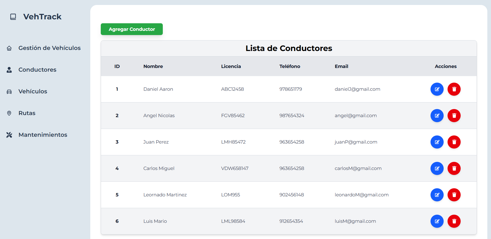

### 📌 **Formulario para Crear/Actualizar Conductores**
Formulario para agregar o modificar la información de un conductor.

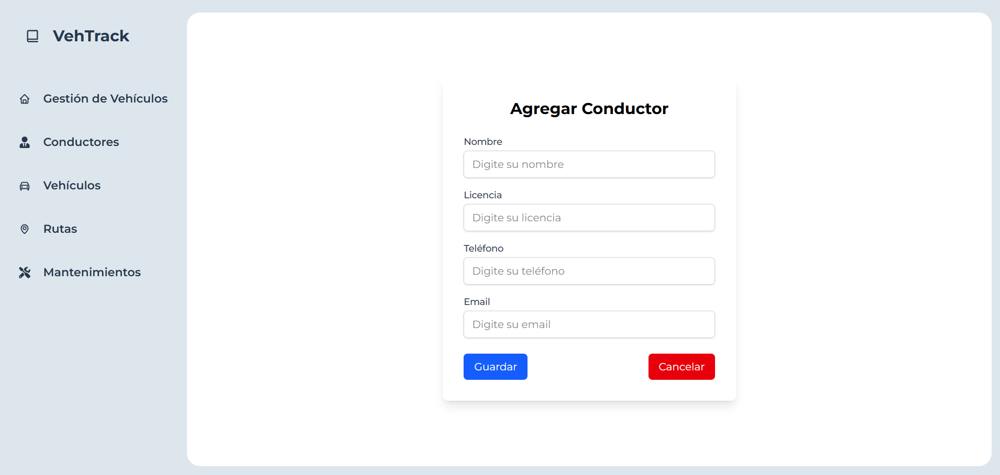

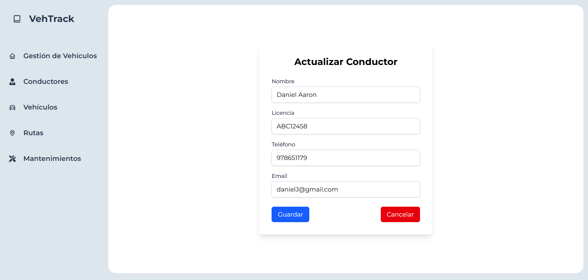

### 🔹 **Gestión de Vehículos**
Listado de vehículos registrados con opciones para agregar, editar y eliminar.

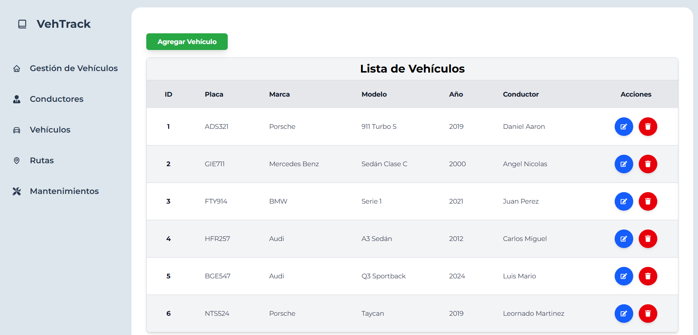

### 📌 **Formulario para Crear/Actualizar Vehículos**
Formulario para agregar o modificar la información de un vehículos.

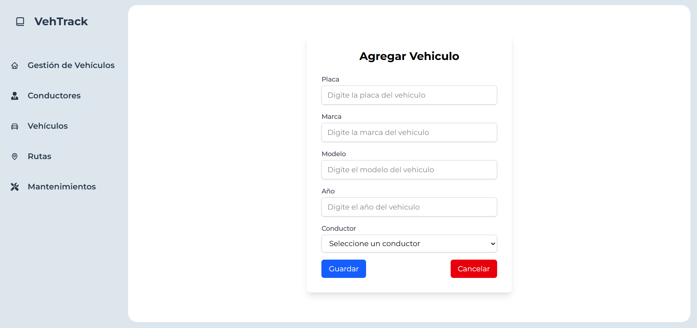

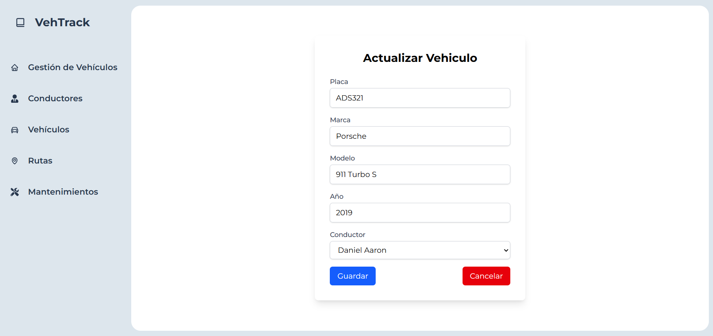

### 🔹 **Gestión de Rutas**
Listado de rutas registrados con opciones para agregar, editar y eliminar.

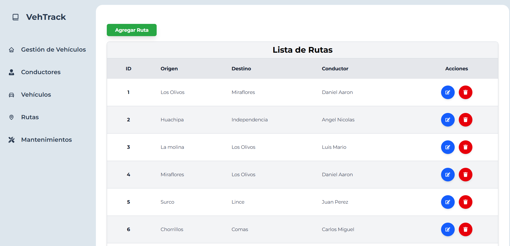

### 📌 **Formulario para Crear/Actualizar Rutas**
Formulario para agregar o modificar la información de un Rutas.

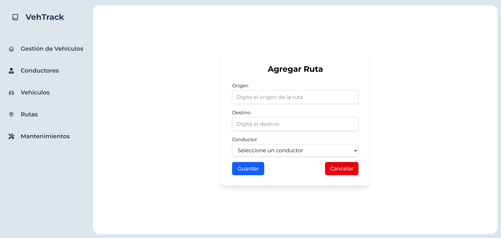

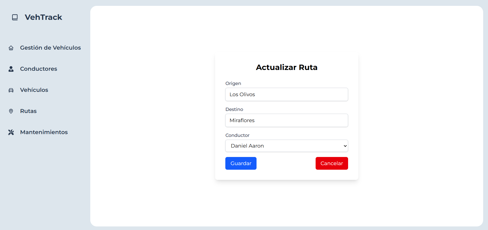

### 🔹 **Gestión de Mantenimientos**
Listado de mantenimientos registrados con opciones para agregar, editar y eliminar.


### 📌 **Formulario para Crear/Actualizar Mantenimientos**
Formulario para agregar o modificar la información de un Mantenimientos.

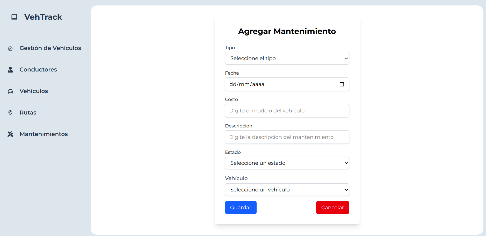

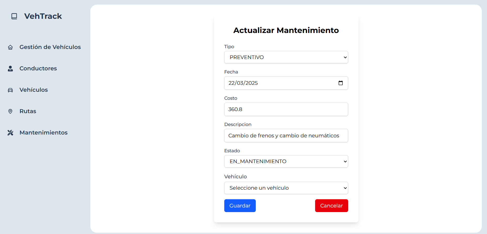

## 📊 **Estructura de la Base de Datos**
A continuación se muestra un esquema de las tablas y sus relaciones en la base de datos.

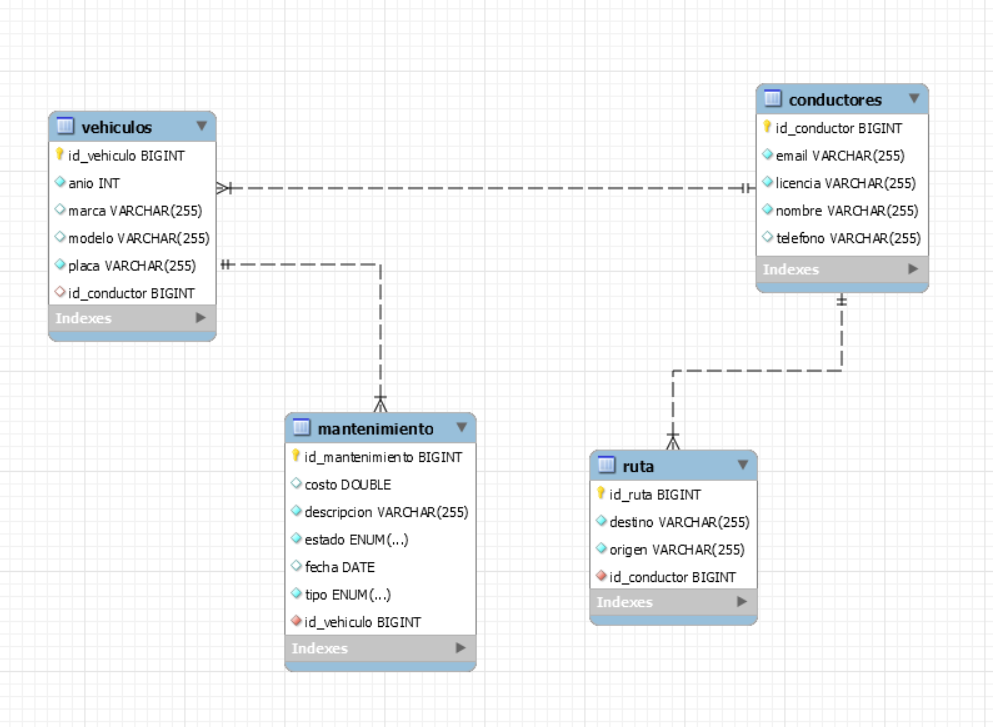


   

